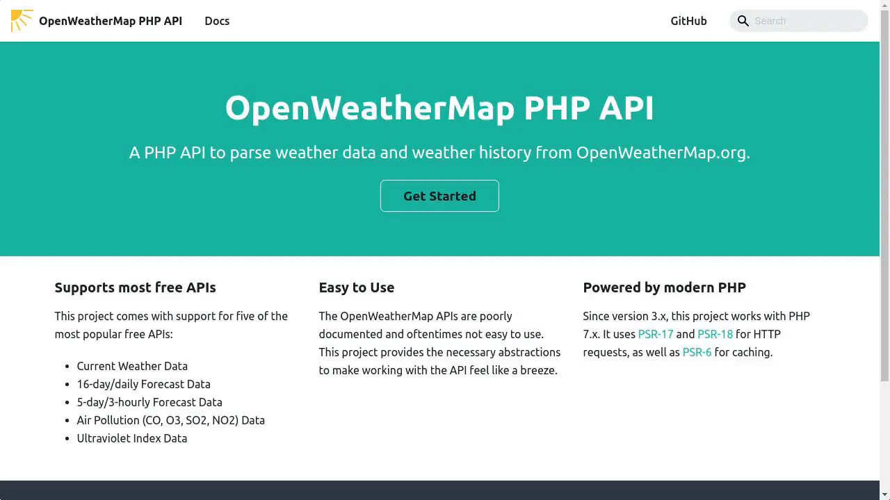

# Offline / Local Search for Docusaurus v2+


[](https://github.com/prettier/prettier)


Offline / local search for Docusaurus **v2+** that works behind your firewall.

Feature Highlights:

- Supports multiple documentation versions
- Supports documentation written in languages other than English
- Highlights search results
- Customized parsers for docs, blogs, and general pages
- Lazy-loads the index



> Note: We use the open source [algolia/autocomplete](https://github.com/algolia/autocomplete) library for the searchbox.
> This library is just used as the frontend, and,
> unlike the default Docusaurus search experience ([algolia/docsearch](https://docsearch.algolia.com/)),
> **does not connect to any Algolia or third-party servers**.

## Installation

```bash
npm install @cmfcmf/docusaurus-search-local
```

or

```bash
yarn add @cmfcmf/docusaurus-search-local
```

## Usage

Add this plugin to the `plugins` array in `docusaurus.config.js`.

```js
module.exports = {
  // ...
  plugins: [require.resolve("@cmfcmf/docusaurus-search-local")],

  // or, if you want to specify options:

  // ...
  plugins: [
    [
      require.resolve("@cmfcmf/docusaurus-search-local"),
      {
        // Options here
      },
    ],
  ],
};
```

The following options are available (defaults are shown below):

```js
{
  // whether to index docs pages
  indexDocs: true,

  // Whether to also index the titles of the parent categories in the sidebar of a doc page.
  // 0 disables this feature.
  // 1 indexes the direct parent category in the sidebar of a doc page
  // 2 indexes up to two nested parent categories of a doc page
  // 3...
  //
  // Do _not_ use Infinity, the value must be a JSON-serializable integer.
  indexDocSidebarParentCategories: 0,

  // whether to index blog pages
  indexBlog: true,

  // whether to index static pages
  // /404.html is never indexed
  indexPages: false,

  // language of your documentation, see next section
  language: "en",

  // setting this to "none" will prevent the default CSS to be included. The default CSS
  // comes from autocomplete-theme-classic, which you can read more about here:
  // https://www.algolia.com/doc/ui-libraries/autocomplete/api-reference/autocomplete-theme-classic/
  // When you want to overwrite CSS variables defined by the default theme, make sure to suffix your
  // overwrites with `!important`, because they might otherwise not be applied as expected. See the
  // following comment for more information: https://github.com/cmfcmf/docusaurus-search-local/issues/107#issuecomment-1119831938.
  style: undefined,

  // The maximum number of search results shown to the user. This does _not_ affect performance of
  // searches, but simply does not display additional search results that have been found.
  maxSearchResults: 8,

  // lunr.js-specific settings
  lunr: {
    // When indexing your documents, their content is split into "tokens".
    // Text entered into the search box is also tokenized.
    // This setting configures the separator used to determine where to split the text into tokens.
    // By default, it splits the text at whitespace and dashes.
    //
    // Note: Does not work for "ja" and "th" languages, since these use a different tokenizer.
    tokenizerSeparator: /[\s\-]+/,
    // https://lunrjs.com/guides/customising.html#similarity-tuning
    //
    // This parameter controls the importance given to the length of a document and its fields. This
    // value must be between 0 and 1, and by default it has a value of 0.75. Reducing this value
    // reduces the effect of different length documents on a term’s importance to that document.
    b: 0.75,
    // This controls how quickly the boost given by a common word reaches saturation. Increasing it
    // will slow down the rate of saturation and lower values result in quicker saturation. The
    // default value is 1.2. If the collection of documents being indexed have high occurrences
    // of words that are not covered by a stop word filter, these words can quickly dominate any
    // similarity calculation. In these cases, this value can be reduced to get more balanced results.
    k1: 1.2,
    // By default, we rank pages where the search term appears in the title higher than pages where
    // the search term appears in just the text. This is done by "boosting" title matches with a
    // higher value than content matches. The concrete boosting behavior can be controlled by changing
    // the following settings.
    titleBoost: 5,
    contentBoost: 1,
    tagsBoost: 3,
    parentCategoriesBoost: 2, // Only used when indexDocSidebarParentCategories > 0
  }
}
```

You can now use the search bar to search your documentation.

**Important: Search only works for the statically built documentation (i.e., after you ran `npm run docusaurus build` in your documentation folder).**

**Search does **not** work in development (i.e., when running `npm run docusaurus start`).**
If you want to test search locally, first build the documentation with `npm run docusaurus build`, and then serve it via `npm run docusaurus serve`.

### Non-English Documentation

Use the `language` option if your documentation is not written in English. You can either specify a single language or an array of multiple languages.
The following languages are available:

    ar, da, de, en, es, fi, fr, hi, hu, it, ja, nl, no, pt, ro, ru, sv, th, tr, vi, zh

**Important: For Chinese language support (`zh`), you also have to install the `nodejieba` npm package at `^2.5.0`.**

### Documentation Versions

Documentation versions created with the official Docusaurus docs plugin are supported.
The search bar defaults to the latest version (not `next`, but the latest version defined in `versions.json`) when not on a documentation page (e.g., when looking at a blog post or a static page).
If the user visits a documentation page, the version is extracted from the page and search will only search the documentation of that version.
The searchbar placeholder text always reflects the currently detected documentation version.

### Internationalization

This plugin supports documentation using [Docusaurus i18n](https://docusaurus.io/docs/i18n/introduction) out of the box..
Please contribute additional translations by creating a new translation file in the [codeTranslations](packages/docusaurus-search-local/codeTranslations) subfolder and submitting a PR.

You can also adjust translations by modifiying the translations in `<yourfolder>/i18n/<locale>/code.json` that start with `cmfcmf/d-s-l.`.
Read more at: https://docusaurus.io/docs/i18n/tutorial#translate-json-files

### Debugging

If building your documentation produces an error, you can build it in debug mode to figure out
which page is causing it. To do so, simply set the `DEBUG` environment variable when building
your documentation: `DEBUG=1 npm run docusaurus build`.

## CONTRIBUTING

Please see the [CONTRIBUTING.md](CONTRIBUTING.md) file for further information.

## License

MIT
